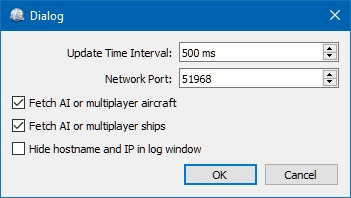

## Menu and Options {#menu}

###  File -> Quit {#file-quit}

Exits the application. Will ask for confirmation if there are still clients connected.

### Tools -> FSX or Prepar3D / X-Plane {#tools-sim}

Chooses the simulator connection. These functions are also available on the toolbar.

### Tools -> Reset Messages {#tools-reset-messages}

This will re-enable all dialogs that were disabled by clicking `Do not show this dialog again` or similar messages.

### Tools -> Toolbar {#tools-toolbar}

Shows or hides the toolbar.

###  Tools -> Options {#tools-options}

Opens the `Options` dialog which has the following settings:

* `Update Time Interval`: Allowed range is 50 milliseconds up to 1 second. _Little Navconnect_ fetches data from Flight Simulator and sends it to all clients (i.e. _Little Navmap_) using this time interval. Increase this value if you get a warning message like shown below:

  `[2016-07-27 16:45:35] Dropped more than 50 packages. Reason: Missing reply. Increase update time interval.`

  Dropped packages can also appear if the _Little Navmap_ cannot respond because a dialog is open.

* `Network Port`: This can normally be left at default. Change this value only if another application occupies this port and you get an error message like shown below when starting _Little Navconnect_:

  `[2016-07-27 16:45:35] Unable to start the server: The bound address is already in use.`

* `Fetch AI or multiplayer aircraft` and `Fetch AI or multiplayer ships`: Disables fetching of AI vehicles and the transfer across the network. This can be useful for performance reasons if you use large amounts of AI but do not want to see it in _Little Navmap_. Note that ship AI is not available on X-Plane.

* `Hide host name and IP in log window`: Check this option to disable printing of host name and IP address on startup. This can be useful for streaming sessions where _Little Navconnect_ window is visible to others.

_**Picture above:** Little Navconnect Options Dialog with default settings._

####  Help Menu -> Contents (Online) {#help-menu-contents}

Shows the online help in your default web browser.

####  Help Menu -> Contents (Offline, PDF) {#help-menu-contents-offline}

Shows the offline help PDF document in your default PDF viewer.

####  Help Menu -> About Little Navconnect {#help-menu-about-little-navconnect}

Shows version and revision number for _Little Navconnect_, also contains links to the configuration file, log file and the author's e-mail addresses.

####  Help Menu -> About Qt {#help-menu-about-qt}

Information about the [Qt application framework](https://www.qt.io) that is used by _Little Navconnect_.

