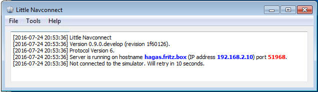

# Little Navconnect User Manual {#little-navconnect-user-manual-0}

Version 1.1.0.devel

## Installation {#installation}

`Highlighted text` is used to denote window, menu, button, file or directory names.

An installer or setup program is not available.

Do not extract the archive into the folder `c:\Program Files\` or `c:\Program Files (x86)\` since you will need administrative privileges in some Windows versions. Since Windows keeps control on these folders other problems might occur like replaced or deleted files.

The zip archive contains the files `vcredist_x86.exe` and `vcredist_x64.exe` which install the MSVC 2013 runtime distributables. Runing both installers is recommended. The installation will provide a uninstall and repair option if a runtime distributables is already installed and can be skipped in case.

Extract the Zip archive into a folder like `c:\Own Programs\Little Navconnect`. Then start the program by double-clicking `littlenavconnect.exe`.

_Little Navconnect_ is a 32-bit application and was tested with Windows 7, Windows 8 and Windows 10.

Windows XP is not supported.

### Other Simulators than FSX SP2 {#other-simulators-than-fsx-sp2}

This program was compiled using plain FSX SP2 (no Acceleration) SimConnect version 10.0.61259.0.

You might have to install an older version of SimConnect if you use _Prepar3D_ or _FSX Steam Edition_. If not sure about this simply try _Little Navconnect_ out. If it fails with an error message follow the instructions below:

_Prepar3D_: In the same directory as `Prepar3D.exe` is a `redist\Interface` directory (normally `C:\Program Files (x86)\Lockheed Martin\Prepar3D v3\redist\Interface`). There are multiple legacy versions of SimConnect available. You have to install `FSX-SP2-XPACK.msi` for _Little Navconnect_.

_FSX Steam Edition_: The installation adds the folder `C:\Program Files (x86)\Steam\SteamApps\common\FSX\SDK\Core Utilities Kit\SimConnect SDK\LegacyInterfaces` where you can find the legacy SimConnect interfaces.

## General {#general}

_Little Navconnect_ acts as an agent that connects [Little Navmap](https://albar965.github.io/littlenavmap.html) with a flight simulator. This saves the pain of setting up a remote SimConnect link and allows using _Little Navmap_ on Linux, macOS or older Windows XP computers.

_Little Navmap_ cannot connect to the flight simulator directly. The _Little Navconnect_ agent is always needed, even if all programs run on the same computer.

## Usage {#usage}

The setup and link procedure is the same for both remote connections and local connections. In the latter case all programs run on the same computer which is both flying and client computer.

1.  Install _Little Navconnect_ on the flying computer. Start it and take note of the message that is printed in the logging window. You only need the colored values. You can use the IP address or the hostname. The program will automatically connect to the flight simulator using SimConnect, if found. If no simulator was found it will retry in 10 second intervals. _Little Navconnect_ can print multiple IP addresses or hostnames depending on your network configuration. This can happen if you have ethernet plugged in and are connected using wireless LAN too, for example. You have to try all addresses if you are unsure which one to use. `localhost` and `127.0.0.1` will be used if you are not connected to a network.

    

    Picture above: _Little Navconnect_ is running and waiting for a flight simulator.

    Change the port in the `Options` dialog if you see an error message like shown below:

    <pre>[2016-07-27 16:45:35] Unable to start the server: The bound address is already in use.
    </pre>

2.  Start _Little Navmap_ on the client computer.
3.  Open the connection dialog in _Little Navmap_ by selecting `Main Menu` -&gt; `Tools` -&gt; `Flight Simulator Connection`.

    

    Picture above: Connect dialog with correct values to access the _Little Navconnect_ shown above.

4.  Add the value for hostname. This can be either the hostname or the IP address printed by _Little Navconnect_. You can use `localhost` if all programs are running on the same computer.
5.  Check the value for the port. `51968` is the default value and does not need to be changed usually.
6.  Click connect. The dialog will close and _Little Navmap_ will try to establish a connection in the background which can take some time, depending on your network. Your aircraft will show up on the map and on the `Simulator Aircraft` dock window once a flight is set up and loaded on the simulator. You will see the message `Connected. Waiting for update.` in the `Simulator Aircraft` dock window if no flight is loaded yet (i.e. the simulator still shows the opening screen). Note that it sometimes can take a while until an error is shown if you used the wrong values for hostname or port.

## Menu {#menu}

### File -&gt; Quit {#file-quit}

Exits the application. Will ask for confirmation if there are still clients connected.

### Tools -&gt; Reset Messages {#tools-reset-messages}

This will re-enable all dialogs that were disabled by clicking `Do not show this dialog again` or similar messages.

### Tools -&gt; Options {#tools-options}

Opens the `Options` dialog which has only two settings:

*   Update Time Interval: Allowed range is 100 milliseconds up to 2 seconds. _Little Navconnect_ fetches data from Flight Simulator and sends it to all clients (i.e. _Little Navmap_) using this time interval. Increase this value if you get a warning message like shown below:

    <pre>[2016-07-27 16:45:35] Dropped more than 50 packages. Reason: Missing reply. Increase update time interval.
    </pre>

    Dropped packages can also appear if the _Little Navmap_ cannot respond because a dialog is open.
*   Network Port: This can normally be left at default. Change this value only if another application occupies this port and you get an error message like shown below when starting _Little Navconnect_:

    <pre>[2016-07-27 16:45:35] Unable to start the server: The bound address is already in use.
    </pre>

#### Help Menu -&gt; Contents {#help-menu-contents}

Shows this help in your default web browser.

#### Help Menu -&gt; About Little Navconnect {#help-menu-about-little-navconnect}

Shows version and revision number for _Little Navconnect_, also contains links to the configuration file, log file and the author&#039;s e-mail addresses.

#### Help Menu -&gt; About Qt {#help-menu-about-qt}

Information about the [Qt application framework](https://www.qt.io) that is used by _Little Navconnect.

## How to report a Bug {#how-to-report-a-bug}

If something goes wrong send me _Little Navconnect_&#039;s log file and configuration file which both can be located in the about dialog. My e-mail address is shown in the about dialog of _Little Navconnect_ as well.

Please add all steps that are neccessary to reproduce the error.

If you&#039;re concerned about privacy when sending log files: The log files will contain all paths (like your `Documents` directory) which will also include your username as a part of the path. They might also contain your computer&#039;s name IP address in your network.

In no case file names from anything else than flight simulator scenery or configuration files are included. No names or content of personal files is included in the log files.

I&#039;d suggest to remove this information if you&#039;re concerned about it.

I strongly recommend to send the log files by PM or by email and not attach them to forum posts where they are publicly visible.

## Files {#files}

Log files of _Little Navconnect_ for Windows 7/8/10 are typically stored in the directory:

`C:\Users\YOURUSERNAME\AppData\Local\Temp`

The program keeps three log files and rotates these on each startup. So you can find up to three logs:

`abarthel-little_navconnect.log`, `abarthel-little_navconnect.log.1` and `abarthel-little_navconnect.log.2`.

All configuration files of my programs for Windows 7/8/10 are typically stored in the directory:

`C:\Users\YOURUSERNAME\AppData\Roaming\ABarthel`

There are one configuration file for this program:

`little_navconnect.ini`: INI style configuration file. Text file.

## Acknowlegments {#acknowlegments}

A big thank-you for all people supporting me throughout the beta phase, sending me their log files, screen shots, friendly messages and more.

Special thanks to Roberto for his valuable input.

Thanks to all in the forums who supported me and gave invaluable feedback during the public beta:

[AVSIM](http://www.avsim.com), [SimOuthouse](http://www.sim-outhouse.com), [FlightX.net](http://flightx.net) and [FSDeveloper.com](http://www.fsdeveloper.com).

## License {#license}

This program is free software: you can redistribute it and/or modify it under the terms of the GNU General Public License as published by the Free Software Foundation, either version 3 of the License, or (at your option) any later version.

This program is distributed in the hope that it will be useful, but WITHOUT ANY WARRANTY; without even the implied warranty of MERCHANTABILITY or FITNESS FOR A PARTICULAR PURPOSE. See the GNU General Public License for more details.

You should have received a copy of the GNU General Public License along with this program. If not, see &lt;[http://www.gnu.org/licenses/](http://www.gnu.org/licenses/)&gt;.

Last update 2016-10-25