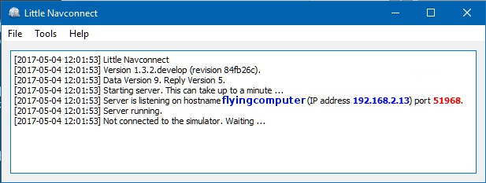
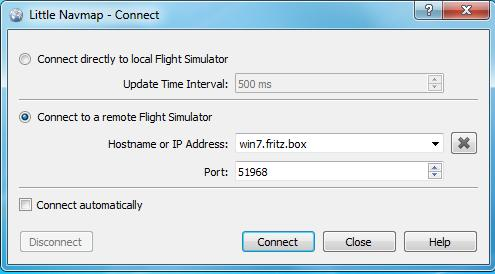

## Uso {#usage}

Recibirá un mensaje de error si el protocolo de _Little Navmap_, _Little Navconnect_ o _Little Xpconnect_ no coinciden. Asegúrese de usar las últimas versiones de todos los programas, o use las incluidas en la descarga del archivo _Little Navmap_.

### Computadora de Vuelo.

Instale  _Little Navconnect_ en la computadora que use para volar. Inicielo y tome nota del mensaje que aparece en la ventana de registro. Solo necesitará los valores coloreados. Puede usar la direccion IP o el nombre del servidor.

El programa se conectará automáticamente al simulador de vuelo mediante SimConenect, si lo encuentra.
Puede cambiar la conexión a X-Plane y se conectará automáticamente al plugin *Little Xpconnect*, si X-Plane está ejecutándose. Si no se encuentra ningún simulador, la conexión se reintentará a intervalos de 10 segundos.

_Little Navconnect_ puede imprimir múltiples direcciones IP, o nombres de servidores, dependiendo de su configuración de red. Esto puede suceder si está conectado a Ethernet, o usando una LAN inalámbrica, por ejemplo. Tiene que probar todas las direcciones si no está seguro de cual utilizar.

_**Figura Superior:** Little Navconnect está ejecutándose y esperando por un simulador de vuelo.   Los botones _`FSX o Prepar3D`_ y _`X-Plane`_  no se muestran en macOs y Linux, o si Sim Connnect no está disponible._

Cambie el puerto en el cuadro de dialogo `Opciones` si aparece un mensaje de error como el que se muestra debajo:

`[2016-07-27 16:45:35] Imposible iniciar el servidor: El valor de enlace está en uso.`

### Cliente o Computadora Remota

2.  Inicie _Little Navmap_ en la computadora cliente.
3.  Abra el diálogo de conexión en _Little Navmap_ seleccionando `Menu Principal` -> `Herramientas` -> `Conexión Simulador de Vuelo`.

    

    _**Figura Superior:** Diálogo de conexión con los valores correctos para acceder a_Little Navconnect_.

4. Seleccione `Conectar a simulador de vuelo remoto`.
4. Añada el valor para nombre del servidor. Puede ser un nombre de servidor o dirección IP de los impresos por _Little Navconnect_.
5. Compruebe el valor para el puerto. `51968` es el valor por defecto y habitualmente no es necesario cambiarlo.
6. Pulse `Conectar`. El diálogo se cerrará y _Little Navmap_ intentará establecer una conexión en segundo plano, lo que puede llevar algun tiempo, dependiendo de su red. Su avión se mostrará en el mapa, y en la ventana `Simulator Aircraft`, una vez que el vuelo esté configurado y cargado. Si el vuelo no está cargado todavía, verá el mensaje `Conectado. Esperando actualización` en la ventana `Simulator Aircraft` (por ejemplo, si el simulador aun está en la pantalla de inicio).

Tenga en cuenta que puede pasar algún tiempo hasta que se muestre el error, si se usaron valores erróneos para el servidor o el puerto.
