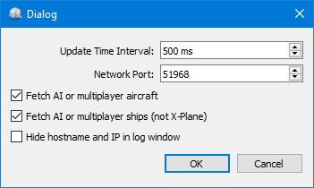

Menu and Options
----------------

.. _file-quit:

|Quit| File -> Quit
~~~~~~~~~~~~~~~~~~~

Exits the application. Will ask for confirmation if there are still
clients connected.

.. _tools-sim:

Tools -> FSX or Prepar3D / X-Plane
~~~~~~~~~~~~~~~~~~~~~~~~~~~~~~~~~~

Chooses the simulator connection. These functions are also available on
the toolbar.

.. _tools-reset-messages:

Tools -> Reset Messages
~~~~~~~~~~~~~~~~~~~~~~~

This will re-enable all dialogs that were disabled by clicking
``Do not show this dialog again`` or similar messages.

.. _tools-toolbar:

Tools -> Toolbar
~~~~~~~~~~~~~~~~

Shows or hides the toolbar.

.. _tools-options:

|Settings| Tools -> Options
~~~~~~~~~~~~~~~~~~~~~~~~~~~~

Opens the ``Options`` dialog which has the following settings:

-  ``Update Time Interval``: Allowed range is 50 milliseconds up to 1
   second. *Little Navconnect* fetches data from Flight Simulator and
   sends it to all clients (i.e. *Little Navmap*) using this time
   interval. Increase this value if you get a warning message like shown
   below:

   ``[2016-07-27 16:45:35] Dropped more than 50 packages. Reason: Missing reply. Increase update time interval.``

   Dropped packages can also appear if the *Little Navmap* cannot
   respond because a dialog is open.

-  ``Network Port``: This can normally be left at default. Change this
   value only if another application occupies this port and you get an
   error message like shown below when starting *Little Navconnect*:

   ``[2016-07-27 16:45:35] Unable to start the server: The bound address is already in use.``

-  ``AI fetch radius``: Changes the radius around the user aircraft that is used to include AI or multiplayer aircraft.
   Using higher values with a lot of AI or multiplayer aircraft can cause stutters in the simulator.
   The unit is always nautical miles (1 NM equals to 1.852 km).
   Note that FSX, P3D and MSFS allow a maxium of 105 NM.

-  ``Fetch AI or multiplayer aircraft`` and
   ``Fetch AI or multiplayer ships``: Disables fetching of AI vehicles
   and the transfer across the network. This can be useful for
   performance reasons if you use large amounts of AI but do not want to
   see it in *Little Navmap*. Note that ship AI is not available on
   X-Plane.

-  ``Hide host name and IP in log window``: Check this option to disable
   printing of host name and IP address on startup. This can be useful
   for streaming sessions where *Little Navconnect* window is visible to
   others.

      *Little Navconnect* Options Dialog with default settings.

.. _help-menu-contents:

|Help| Help Menu -> Contents (Online)
~~~~~~~~~~~~~~~~~~~~~~~~~~~~~~~~~~~~~~

Shows the online help in your default web browser.

.. _help-menu-contents-offline:

|Help| Help Menu -> Contents (Offline, PDF)
~~~~~~~~~~~~~~~~~~~~~~~~~~~~~~~~~~~~~~~~~~~~~~~~

Shows the offline help PDF document in your default PDF viewer.

.. _help-menu-about-little-navconnect:

|About| Help Menu -> About Little Navconnect
~~~~~~~~~~~~~~~~~~~~~~~~~~~~~~~~~~~~~~~~~~~~~~~

Shows version and revision number for *Little Navconnect*, also contains
links to the configuration file, log file and the author's e-mail
addresses.

.. _help-menu-about-qt:

|About Qt| Help Menu -> About Qt
~~~~~~~~~~~~~~~~~~~~~~~~~~~~~~~~~~~~~~

Information about the `Qt application framework <https://www.qt.io>`__
that is used by *Little Navconnect*.

.. |Quit| image:: ../images/icon_application-exit.png
.. |Settings| image:: ../images/icon_settings.png
.. |Help| image:: ../images/icon_help.png
.. |About| image:: ../images/icon_navconnect.png
.. |About Qt| image:: ../images/icon_qticon.png

