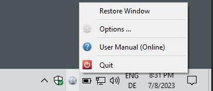
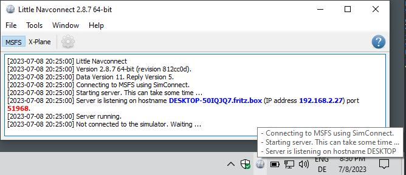

Tray Icon
----------------

The tray icon in the Windows taskbar or other operating system toolbars
is visible if supported by the operating system and one of the options ``Minimize to System Tray`` or
``Start minimized to System Tray`` is enabled.

It allows to run *Little Navconnect* without main window.

**The following actions are available on the system tray icon:**

-  Left mouse click: Toggles the visibility of the main window.
-  Right mouse click: Shows the context menu.
-  Tooltip: Hovering the mouse above the tray icon shows a small tooltip window with the last messages from the main window.

      *Little Navconnect* taskbar tray icon on Windows with the context menu after right click. The main window is hidden.

      *Little Navconnect* tray icon on Windows taskbar with tooltip showing log messages and the main window visible.

.. _tray-menu:

Context Menu
~~~~~~~~~~~~~~~~~~~~

.. _tray-restore:

Restore Window
^^^^^^^^^^^^^^^^^^^^^^^^^^^^^^^^

Opens the main window again. This is the same as a single click on the icon.

.. _tray-options:

|Settings| Options
^^^^^^^^^^^^^^^^^^^^^^^^^^^^^^^^

Opens the options dialog which allows to adjust connection settings.

See chapter :doc:`OPTIONS` for more information.

.. _tray-help:

|Help| User Manual (Online)
^^^^^^^^^^^^^^^^^^^^^^^^^^^^^^^^

Shows the online help in the default web browser.

.. _tray-quit:

|Quit| Quit
^^^^^^^^^^^^^^^^^^^^^^^^^^^^^^^^

Exits the application. Will ask for confirmation if there are still
clients connected.

.. |Quit| image:: ../images/icon_application-exit.png
.. |Settings| image:: ../images/icon_settings.png
.. |Help| image:: ../images/icon_help.png

