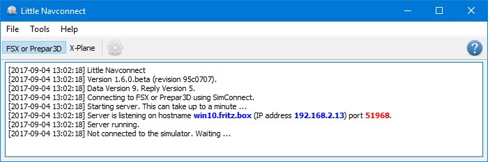
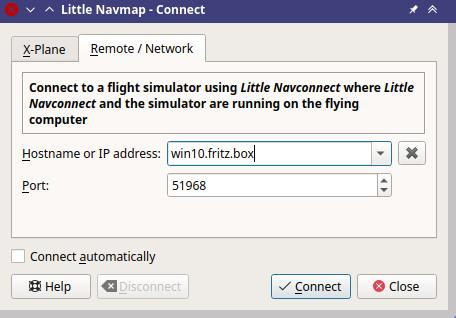

Usage
-----

You will receive an error message if the protocol of *Little Navmap*,
*Little Navconnect* or *Little Xpconnect* does not match. Make sure to
use the latest versions of all programs or use the ones included in the
*Little Navmap* download archive.

Flying Computer
~~~~~~~~~~~~~~~

Install *Little Navconnect* on the flying computer. Start it and take
note of the message that is printed in the logging window. You only need
the colored values. You can use the IP address or the host name.

The program will automatically connect to the flight simulator using
the included SimConnect. You can change the connection to X-Plane and it
will connect automatically to the *Little Xpconnect* plugin if X-Plane
is running. If no simulator was found it will retry in 10 second
intervals.

*Little Navconnect* can print multiple IP addresses or host names
depending on your network configuration. This can happen if you have
Ethernet plugged in and are connected using wireless LAN too, for
example. You have to try all addresses if you are unsure which one to
use.

     *Little Navconnect* is running and waiting for a
     flight simulator. The ``FSX or Prepar3D`` and ``X-Plane`` buttons are
     not shown on macOS and Linux or if SimConnect is not available.

Change the port in the ``Options`` dialog if you see an error message
like shown below:

``[2016-07-27 16:45:35] Unable to start the server: The bound address is already in use.``

Remote Computer
~~~~~~~~~~~~~~~~~~~~~~~~~

Also called client or networked computer.

#. Start *Little Navmap* on the client computer.
#. Open the connection dialog in *Little Navmap* by selecting
   ``Main Menu`` -> ``Tools`` -> ``Flight Simulator Connection``.

   Connect dialog with correct values to access the Little Navconnect shown above.

#. Select ``Connect to a remote Flight Simulator``.
#. Add the value for host name or the
   IP address printed by *Little Navconnect*.
#. Check the value for the port. ``51968`` is the default value and does
   not need to be changed usually.
#. Click ``Connect``. The dialog will close and *Little Navmap* will try
   to establish a connection in the background which can take some time,
   depending on your network. Your aircraft will show up on the map and
   on the ``Simulator Aircraft`` dock window once a flight is set up and
   loaded on the simulator. You will see the message
   ``Connected. Waiting for update.`` in the ``Simulator Aircraft`` dock
   window if no flight is loaded yet (i.e. the simulator still shows the
   opening screen).

.. note::

    Note that it sometimes can take a while until an error is shown if you
    used the wrong values for host name or port.

